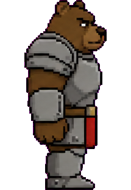
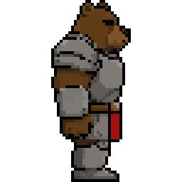
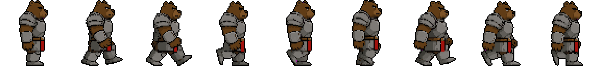

# pixel-sprite-forge

Turn a single character reference image into a clean, loopable pixel-art walk
cycle — using [MiniMax H3](https://huggingface.co/MiniMaxAI/MiniMax-H3) for the
animation and a deterministic post-processing chain for the pixel-art look.

[简体中文](README.zh-CN.md)

<p align="center">
  
  &nbsp;&nbsp;&nbsp;➜&nbsp;&nbsp;&nbsp;
  
</p>

<p align="center"><em>one reference image (left) ➜ 9-frame looping walk cycle, 64×64 RGBA, 24 colours (right)</em></p>



The nine frames above are the actual output of the commands below, checked into
[`examples/`](examples/). Measured on them:

| property | value |
| --- | --- |
| sprite size | 64×64 RGBA (generated at 512×512, downsampled 1/8) |
| palette | 24 colours, shared by all 9 frames |
| semi-transparent pixels | 0 (hard alpha) |
| gait | 2 steps = one full cycle, last frame leads back into the first |

The preview images above are shown at 4× nearest-neighbour zoom; the sprites in
[`examples/bear_walk/`](examples/bear_walk/) are the real 64×64 assets.

```
reference image  ──▶  H3 Ref2VA  ──▶  cycle extraction  ──▶  quantisation  ──▶  sprite frames
   215×311           39 frames          9 frames            24 colours          64×64 RGBA
```

Everything after the generation step is pure NumPy/Pillow on the CPU — no model
weights, no GPU. Only the generation step needs ComfyUI.

---

## Why this exists

Video models can animate a character, but their raw output is not pixel art:
edges are soft, colours drift frame to frame, and a single clip rarely contains
a complete gait cycle. This repo records what actually worked, including the
non-obvious constraints that cost the most time to find.

## Quick start

```bash
pip install numpy pillow

# post-processing only, on synthetic frames (no weights required)
python tests/smoke.py
```

Full pipeline, once ComfyUI and the H3 weights are in place:

```bash
python src/generate_h3.py --ref assets/side_bear.png --frames 39 --walk 4
python src/pick_cycle.py  data/trainset/h3/<run-dir> -k 9 --osc 2
python src/quant_sprite.py <picked-dir> --ref assets/side_bear.png \
       --colors 24 --scale 8 --outline --outline-color 0,0,0 --alpha
```

---

## 1. Generation (MiniMax H3, Ref2VA)

### Weights

| File | Size | Put in |
| --- | --- | --- |
| `minimax_h3_ref2va_pruned_fp8_scaled.safetensors` | 19.5 GiB | `models/diffusion_models/` |
| `qwen3vl_32b_minimax_h3_nvfp4_awq.safetensors` | 14.6 GiB | `models/text_encoders/` |
| `minimax_h3_video_vae_fp16.safetensors` | 4.85 GiB | `models/vae/` |
| `minimax_h3_audio_vae_fp32.safetensors` | 0.56 GiB | `models/vae/` |

All four are in [`Comfy-Org/MiniMax-H3`](https://huggingface.co/Comfy-Org/MiniMax-H3).
The audio VAE is required even if you never use audio.

> **GGUF caveat.** Text-encoder GGUFs built for `stable-diffusion.cpp` are
> rejected by ComfyUI-GGUF with `This gguf file is incompatible with llama.cpp!`.
> The safetensors above avoid the issue entirely.

### Graph

```
UNETLoader ─────────────┐
CLIPLoader(minimax) ────┼─▶ MiniMaxH3ReferenceToVideo ─▶ BasicGuider ─┐
VAELoader(video) ───────┤      ▲ ref_images.ref_image_0               │
VAELoader(audio) ───────┘                                             ▼
KSamplerSelect(res_multistep) + BasicScheduler(simple) ─▶ SamplerCustomAdvanced
                                                                │
                                                    VAEDecode ─▶ SaveImage
```

`BasicGuider` means **no negative prompt and CFG = 1**. Anything you want to
suppress has to be phrased positively in the prompt.

### Three constraints worth knowing before you tune anything

**Frame count is locked to a 17k+5 grid.** Valid lengths are 5, 22, 39, 56, 73,
90, 107, 124… Asking for 9 frames silently gives you 22.

**Steps taken = (frames − 5) / 17.** Measured, exactly linear:

| frames | latent steps | steps walked |
| --- | --- | --- |
| 22 | 7 | 1 |
| 39 | 12 | 2 |
| 56 | 17 | 3 |
| 124 | 37 | 7 |

A full walk cycle is two steps (left + right), so **39 frames is the smallest
usable length**. More is not better: at 124 frames each step spans only 17
frames, and cycle detection during extraction gets noisier.

**The step count in the prompt does nothing.** Asking for 2 / 4 / 6 steps
produced outputs differing by 3–7 mean pixel values, below the 9.73 within-clip
frame-to-frame yardstick. Frame count is the only working control.

### The reference-image trap

The reference is an `Autogrow` input. In the API graph the key must be the
**dot-joined flat key**:

```python
"ref_images.ref_image_0": ["5", 0]     # correct
"ref_images": {"ref_image_0": [...]}   # SILENTLY DROPPED
"ref_image_0": [...]                   # TypeError (at least it fails loudly)
```

The nested form is the dangerous one: no error, images come out, motion looks
fine — and the reference is not used at all. Swapping a bear for a fox produced
**pixel-identical output** (mean difference 0.00).

> **Always ablate a conditioning input right after wiring it.** Feed a
> completely different input and compare mean pixel difference against the
> within-clip frame-to-frame difference as a yardstick. 0.00 means it is not
> connected. Watch runtimes too: a dropped input makes two submissions identical,
> so ComfyUI returns a cached result (3 s instead of 21 s).

### Prompts

Reference the input image as `<Picture 1>` — that is H3's convention.

```
The pixel art game character in <Picture 1> walking in place,
side view, full body, seen from the side.
Keep the exact same character design, colours and pixel art style as <Picture 1>.
The character takes 4 full steps during this clip, alternating left foot and
right foot, lifting each knee high and swinging the legs wide apart between steps.
Flat solid magenta background, static camera,
the character stays centred and does not move across the frame.
```

Optional sharpening clauses (`--edge ol` / `--edge hard` in
`src/generate_h3.py`), phrased positively because there is no negative prompt:

```
ol    Every shape has a bold solid black outline one pixel thick,
      including around each arm and each leg.

hard  Every shape has a bold solid black outline. All colours are flat
      hard-edged fills with no gradients, no soft shading, no anti-aliasing
      and no blur. Every edge is a sharp crisp pixel step, high contrast.
```

Avoid stacking static cues (`walking in place` + `does not move` +
`static camera`) with a request for a full gait cycle — they fight each other.
Put motion early: later clauses get dropped.

---

## 2. Cycle extraction — `pick_cycle.py`

Picks one complete walk cycle out of the clip and downsamples it to N sprite
frames.

Gait phase is measured as the **horizontal spread of the lower-body
foreground** — wide when the legs are apart, narrow when they pass. One
oscillation is one step, so a full cycle spans two (`--osc 2`).

Frames are sampled at **equal phase**, not equal time: dense where the legs
swing fast, sparse where they pass. Uniform sampling drops the extremes (legs
widest / legs together), and those extremes are exactly what makes a walk
readable at sprite scale — lose them and the character looks like it is sliding.

## 3. Post-processing — `quant_sprite.py`

Order matters; each step exists because doing it later or earlier broke
something.

**Dekey before quantising.** The magenta background blends with the character
along the silhouette into a ring of purple mid-tones. Those pixels fall inside
the foreground mask, so k-means spends palette slots representing them and the
real character colours get squeezed out. Strict foreground is grown outward to
overwrite the contaminated ring with clean interior colour, keeping the
silhouette size unchanged.

**Quantise jointly, in OKLab.** All frames share one palette — per-frame
palettes drift and the animation flickers. OKLab rather than RGB because RGB L1
distance does not match perception: a white highlight is "closer" to magenta
than to grey in RGB, so eyes turn magenta.

**Quantise before downsampling.** With a 2× block only 4 pixels vote; over half
the blocks have no clear majority and the tie-break is effectively random —
that is where pixel drift comes from. After quantisation a block contains only
a few palette colours and a clear majority is much more likely. Remaining ties
go to the darker colour, so outlines thicken rather than erode.

**Outline after downsampling.** Applied earlier it gets eaten by block voting
or ends up 1/s pixels wide.

> `quantize.downsample()` fills empty blocks with **black**, not the original
> background colour. If you do not restore the background first, "darkest
> palette colour" as the outline paints black on black — invisible to both eyes
> and metrics.

**Hard alpha only.** Semi-transparent edge pixels are the soft-edge problem in
another form; alpha is thresholded to 0 or 255.

---

## What is not solved

**Pixel drift.** Between adjacent frames, ~63 % of pixels that are foreground in
both change colour. Dekeying moved it from 64.4 % to 63.5 %, so that is not the
cause. The working hypothesis is sub-pixel wobble of the character between
frames, amplified into whole-pixel colour jumps by block voting — frame-to-frame
registration before downsampling would be the fix. Not implemented.

**Edge sharpness comes from post-processing, not from generation.** The
reference used here is not clean pixel art either: 215×311 with 12 864 distinct
colours, i.e. nearly one in five pixels has a unique colour. Its edges already
span ~2 px before generation and ~4 px after. Cleaning the reference before
feeding it to the model is an untested idea.

**One direction only.** Side view. Front, back and diagonals need their own
reference images and have not been attempted.

---

## Layout

```
src/generate_h3.py    ComfyUI API client for H3 Ref2VA
src/pick_cycle.py     gait-phase cycle extraction
src/quant_sprite.py   dekey, quantise, downsample, outline, alpha
src/quantize.py       OKLab palette + downsampling primitives
src/edge_check.py     edge sharpness diagnostics
tests/fixture.py      synthetic walk clip with video-model artefacts
tests/smoke.py        runs the post-processing chain, prints metrics
assets/side_bear.png  example reference
```

## License

MIT — see [LICENSE](LICENSE).
