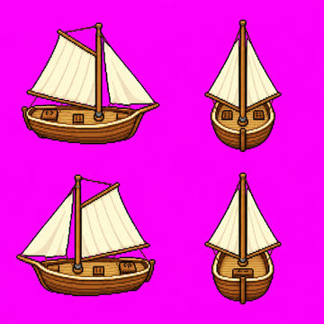
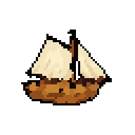
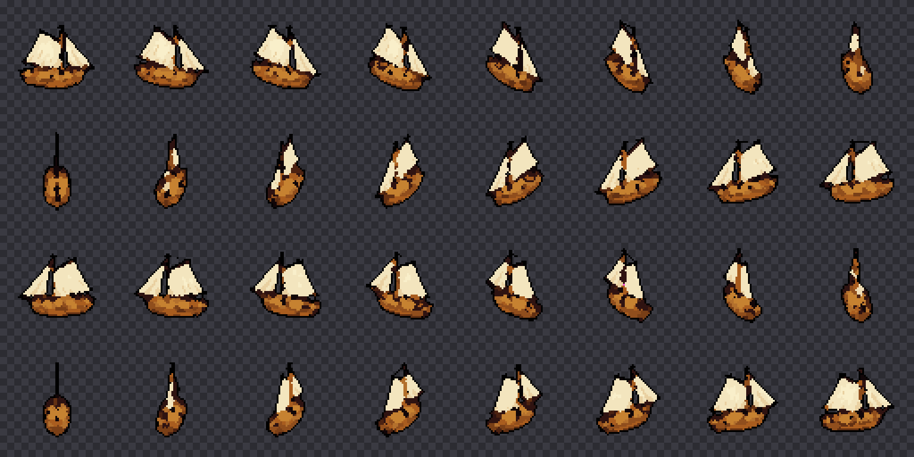

# pixel-sprite-forge

用一张角色参考图生成可循环的像素风走路动画：动画交给
[MiniMax H3](https://huggingface.co/MiniMaxAI/MiniMax-H3)，像素质感交给一条
确定性的后处理链。同一条链也能把一段转圈视频变成
[N 方向精灵](#用例二一段转圈视频--n-方向精灵)（船、载具、道具）。

[English](README.md)

<p align="center">
  
  &nbsp;&nbsp;&nbsp;➜&nbsp;&nbsp;&nbsp;
  
</p>

<p align="center"><em>一张参考图（左）➜ 9 帧可循环走路动画，64×64 RGBA，24 色（右）</em></p>


上面这九帧就是下文那几条命令的真实产物，已提交在
[`examples/`](examples/) 里。实测：

| 指标 | 数值 |
| --- | --- |
| 精灵尺寸 | 64×64 RGBA（512×512 生成，降采样 1/8） |
| 调色板 | 24 色，9 帧共用同一套 |
| 半透明像素 | 0（硬 alpha） |
| 步态 | 2 步 = 一个完整循环，末帧接回首帧 |

上面的预览图是 4 倍最近邻放大显示的，
[`examples/bear_walk/`](examples/bear_walk/) 里才是真正的 64×64 素材。

```
参考图  ──▶  H3 Ref2VA  ──▶  周期抽帧  ──▶  量化后处理  ──▶  精灵帧
215×311      39 帧          9 帧          24 色           64×64 RGBA
```

生成之后的每一步都是纯 NumPy/Pillow、纯 CPU，不需要权重也不需要显卡。
只有生成那一步要 ComfyUI。

---

## 为什么有这个仓库

视频模型能让角色动起来，但原始输出不是像素画：边缘是软的、颜色逐帧漂移、
一段片子里往往走不完一个完整步态周期。这里记录的是**实际跑通的做法**，
包括那些花时间最多才找出来的反直觉约束。

## 快速开始

```bash
pip install numpy pillow

# 只跑后处理，用合成帧，不需要任何权重
python tests/smoke.py
python tests/smoke_spin.py   # 转圈用例
```

配好 ComfyUI 和 H3 权重之后跑完整流程：

```bash
python src/generate_h3.py --ref assets/side_bear.png --frames 39 --walk 4
python src/pick_cycle.py  data/trainset/h3/<生成目录> -k 9 --osc 2
python src/quant_sprite.py <抽帧目录> --ref assets/side_bear.png \
       --colors 24 --scale 8 --outline --outline-color 0,0,0 --alpha
```

---

## 一、生成（MiniMax H3 · Ref2VA）

### 权重

| 文件 | 体积 | 放在 |
| --- | --- | --- |
| `minimax_h3_ref2va_pruned_fp8_scaled.safetensors` | 19.5 GiB | `models/diffusion_models/` |
| `qwen3vl_32b_minimax_h3_nvfp4_awq.safetensors` | 14.6 GiB | `models/text_encoders/` |
| `minimax_h3_video_vae_fp16.safetensors` | 4.85 GiB | `models/vae/` |
| `minimax_h3_audio_vae_fp32.safetensors` | 0.56 GiB | `models/vae/` |

四个都在 [`Comfy-Org/MiniMax-H3`](https://huggingface.co/Comfy-Org/MiniMax-H3)。
国内可从 ModelScope 同名仓库拉，同样的路径结构。音频 VAE 即使不出声也必须有。

> **GGUF 的坑。** 为 `stable-diffusion.cpp` 编的文本编码器 GGUF 会被
> ComfyUI-GGUF 拒收：`This gguf file is incompatible with llama.cpp!`
> 用上面的 safetensors 就完全绕开了。

### 图的结构

```
UNETLoader ─────────────┐
CLIPLoader(minimax) ────┼─▶ MiniMaxH3ReferenceToVideo ─▶ BasicGuider ─┐
VAELoader(video) ───────┤      ▲ ref_images.ref_image_0               │
VAELoader(audio) ───────┘                                             ▼
KSamplerSelect(res_multistep) + BasicScheduler(simple) ─▶ SamplerCustomAdvanced
                                                                │
                                                    VAEDecode ─▶ SaveImage
```

用的是 `BasicGuider`，也就是**没有负面提示词、CFG = 1**。想压制什么，
只能在正面提示词里正着说。

### 调参之前先知道这三条

**帧数锁死在 17k+5 网格上。** 合法值只有 5、22、39、56、73、90、107、124……
请求 9 帧会被静默顶到 22 帧。

**走的步数 =（帧数 − 5）/ 17。** 实测，精确线性：

| 帧数 | latent 步 | 走了几步 |
| --- | --- | --- |
| 22 | 7 | 1 |
| 39 | 12 | 2 |
| 56 | 17 | 3 |
| 124 | 37 | 7 |

一个完整走路循环是两步（左脚 + 右脚），所以 **39 帧是最小可用长度**。
不是越多越好：124 帧时每一步只占 17 帧，抽帧阶段的周期定位反而更noisy。

**提示词里写走几步是无效的。** 要求走 2 / 4 / 6 步，输出两两平均像素差
只有 3~7，低于同一段片子内相邻帧差 9.73 这个标尺。**控制步数只能靠帧数。**

### 参考图的陷阱

参考图是 `Autogrow` 类型的输入。API 图里的键名必须是**点号拼接的扁平键**：

```python
"ref_images.ref_image_0": ["5", 0]     # 正确
"ref_images": {"ref_image_0": [...]}   # 被静默丢弃
"ref_image_0": [...]                   # TypeError（至少它会报错）
```

嵌套那种写法最危险：不报错、能出图、动作看着还不错——但参考图根本没参与。
把熊换成狐狸，输出**逐像素相同**（平均差 0.00）。

> **条件输入接完，第一件事就是做消融。** 喂一个完全不同的输入，
> 比较平均像素差，以同片内相邻帧差为标尺。差 0.00 就是没接上。
> 耗时也要看：输入被丢弃会让两次提交的图完全相同，ComfyUI 直接返回缓存
> （3 秒 vs 21 秒）。

### 提示词

用 `<Picture 1>` 指代参考图，这是 H3 的约定写法。

```
The pixel art game character in <Picture 1> walking in place,
side view, full body, seen from the side.
Keep the exact same character design, colours and pixel art style as <Picture 1>.
The character takes 4 full steps during this clip, alternating left foot and
right foot, lifting each knee high and swinging the legs wide apart between steps.
Flat solid magenta background, static camera,
the character stays centred and does not move across the frame.
```

可选的锐化子句（`src/generate_h3.py` 的 `--edge ol` / `--edge hard`），
因为没有负面提示词，所以全部正着写：

```
ol    Every shape has a bold solid black outline one pixel thick,
      including around each arm and each leg.

hard  Every shape has a bold solid black outline. All colours are flat
      hard-edged fills with no gradients, no soft shading, no anti-aliasing
      and no blur. Every edge is a sharp crisp pixel step, high contrast.
```

别把多个静止信号（`walking in place` + `does not move` + `static camera`）
和"要一个完整步态周期"堆在一起，它们互相打架。动作描述要靠前写，
靠后的子句容易被忽略。

---

## 二、周期抽帧 —— `pick_cycle.py`

从片子里挑出一个完整走路循环，降采样成 N 张精灵帧。

步态相位用**下半身前景的水平展宽**衡量：两腿分开时大、并拢时小。
一次振荡就是一步，一个完整循环跨两次（`--osc 2`）。

抽帧按**相位等距**而不是时间等距：腿甩得快的地方密、并拢的地方疏。
均匀抽会把极值姿势（腿分最开 / 并最拢）抽丢，而恰恰是这几帧决定了
走路在精灵尺度下看不看得懂——丢了就像在滑步。

## 三、后处理 —— `quant_sprite.py`

顺序很要紧，每一步的位置都是踩过坑换来的。

**先去键，再量化。** 品红底会和角色色在轮廓上混出一圈紫调中间色。
这些像素落在前景掩码里，于是 k-means 拿槽位去表示它们，真正的角色色被挤掉。
做法是把严格前景往外生长，用干净的内部色覆盖掉污染环，轮廓大小不变。

**联合量化，在 OKLab 里做。** 所有帧共用一套调色板——逐帧各减各的会漂移，
播起来闪烁。用 OKLab 而不是 RGB，是因为 RGB 的 L1 距离不对应视觉：
白色高光在 RGB 里离品红比离灰色更近，结果眼白会被吸成品红。

**先量化，后降采样。** 2 倍块只有 4 个像素投票，实测过半的块没有明显多数，
平票时选谁基本随机——这就是像素漂移的来源。量化之后块内只剩少数几个
调色板色，出现明显多数的概率大得多。剩下的平票取更暗的色，
这样描边只会变粗不会被啃掉。

**描边在降采样之后做。** 提前做会被块内投票吃掉，或者变成 1/s 像素宽。

> `quantize.downsample()` 把空白块填成**纯黑**而不是原底色。
> 不先把背景填回去的话，"取调色板里最暗的色"当描边 = 黑描边画在黑底上，
> 肉眼和指标都看不见。

**只用硬 alpha。** 半透明边缘就是软边问题的另一种形态，alpha 直接二值化。

---

## 用例二：一段转圈视频 → N 方向精灵

让 H3 把物体原地转一整圈，再按需要的朝向挑帧——同一段视频，造型和配色天然一致。

<p align="center">
  
  &nbsp;➜&nbsp;
  
</p>



```bash
python src/generate_h3.py --ref <四视图.png> --frames 158 --spin "small wooden sailing ship"
python src/pick_rotation.py data/trainset/h3/<生成目录> -n 32 --hue 15,50
python src/quant_sprite.py data/trainset/h3/<生成目录>_rot32 --ref <四视图.png> \
       --lock-ref --colors 24 --scale <脚本打印的 s> --outline --outline-color 0,0,0 --alpha
```

- **参考图用 2×2 四视图**（朝右 / 朝观者 / 朝左 / 背向），由生图模型一次画在一张图里。
  只给侧面的话，看不到的几面全靠模型编。
- **158 帧。** H3 开头会原地晃 20~36 帧，124 帧实测只转到约 300°。
- **用水平宽度量朝向，不用主轴角。** 宽度与镜头俯角无关：侧面最宽、正对最窄，
  极值处取锚点 = 0/90/180/270°，中间用 `acos` 插值。`--hue` 只量船体，
  避免帆和桅杆干扰。转向看第一象限主轴倾斜的正负号。
- **帧按数字排序**（`f100` 不在 `f10` 和 `f11` 之间）；第一个锚点之前的帧是开头的晃动，不参与挑选。

船的实测：转了 366.7°，32 个朝向最大挑帧误差 1.3°，17 色。
已知差异：正对镜头时 H3 把帆画成一条线（侧对镜头），而手绘美术通常让帆朝向观者。

---

## 尚未解决

**像素漂移。** 相邻两帧都属于角色的位置上，约 63% 的像素颜色会变。
去键只把它从 64.4% 降到 63.5%，说明那不是主因。目前的判断是角色在帧间
有亚像素级晃动，被块内投票放大成整像素跳变——解法应该是降采样前做帧间配准，
还没实现。

**边缘的锐利是后处理造出来的，不是从生成里保住的。** 这里用的参考图本身
也不是干净的像素画：215×311 却有 12864 个不同颜色，近 1/5 的像素颜色独一无二。
它的边缘在进模型之前就有约 2 像素过渡，出来变成约 4 像素。
"先把参考图清干净再喂给模型"这条路还没试。

**走路循环只有一个朝向。** 侧面。正面、背面、斜向都需要各自的参考图，尚未尝试。
（刚体物体的多朝向见上面的用例二；角色边走边转向还没覆盖。）

---

## 目录

```
src/generate_h3.py    H3 Ref2VA 的 ComfyUI API 客户端
src/pick_cycle.py     按步态相位抽周期
src/pick_rotation.py  按宽度量朝向，抽 N 方向精灵
src/quant_sprite.py   去键、量化、降采样、描边、透明底
src/quantize.py       OKLab 调色板与降采样原语
src/edge_check.py     边缘锐利度诊断
tests/fixture.py      带视频模型伪影的合成走路片段
tests/smoke.py        跑一遍后处理链并打数值
tests/fixture_spin.py 带真实朝向的合成转圈片段
tests/smoke_spin.py   转圈链路，用真值检查
assets/side_bear.png  示例参考图
```

## 许可

MIT，见 [LICENSE](LICENSE)。
